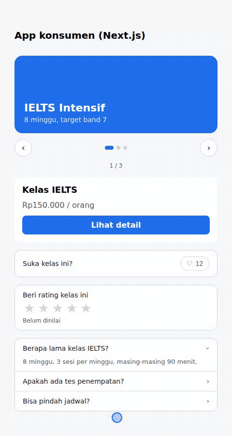
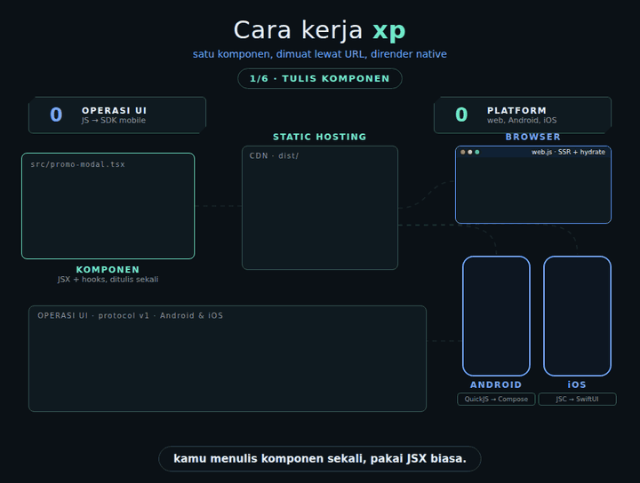

# xp

Tulis komponen sekali, build, lalu muat lewat URL dari web, Android, atau iOS. Di mobile komponennya dirender native (Compose / SwiftUI), bukan WebView.

Ada dua jenis komponen:

- Komponen `@xp/runtime` (JSX + hooks). Hasil build-nya bisa dipakai di web dan di iOS/Android.
- Komponen React, Vue, atau Svelte biasa. Hanya untuk web. Runtime framework-nya ikut di bundle, jadi app pemakai tidak perlu memasang framework tersebut. Komponen Vue bisa dipakai di Next.js, komponen React bisa dipakai di Nuxt.

```bash
npx github:fadhelmurphy/xp build              # interaktif: pilih komponen dan target
npx github:fadhelmurphy/xp build src -t web    # langsung, tanpa pertanyaan
```


## Daftar isi

- [CLI](#cli)
- [xp dev](#xp-dev)
- [Signing](#signing)
- [Komponen @xp/runtime](#komponen-xpruntime)
- [Komponen React, Vue, Svelte](#komponen-react-vue-svelte)
- [Contoh](#contoh)
- [Next.js](#nextjs)
- [Nuxt](#nuxt)
- [Android](#android)
- [iOS](#ios)
- [Cara kerja dan protokol](#cara-kerja-dan-protokol)
- [Status](#status)

## CLI

```
xp build [folder] [opsi]      build komponen (default: src)
xp dev [folder] [opsi]        build, sajikan, dan build ulang setiap file berubah
xp list [folder]              tampilkan komponen dan jenisnya
xp serve [dist] [--port n]    sajikan hasil build, dengan CORS dan cache header
xp keygen [folder]            buat kunci untuk menandatangani manifest
```

Opsi `build`:

```
-t, --target <t>   auto | web | crossplatform   (default: auto)
-o, --only a,b     hanya komponen tertentu (nama file tanpa ekstensi)
    --out <dir>    folder hasil (default: dist)
    --clean        hapus isi folder hasil dulu
-y, --yes          jangan tanya apa-apa
    --sign <file>  tandatangani manifest dengan kunci dari xp keygen
```

Kalau dijalankan di terminal tanpa `--target` atau `--only`, xp akan bertanya dulu:

```
◆  Komponen yang mau di-build?
│  ● Semua (5)
│  ○ Pilih sendiri
```

Pilih "Semua" untuk build semua komponen di folder. Pilih "Pilih sendiri" untuk memilih satu atau beberapa komponen (spasi untuk mencentang, `a` untuk centang semua). Setelah itu xp menanyakan target.

Tanpa menu, misalnya untuk CI:

```bash
npx github:fadhelmurphy/xp build -y                                   # semua komponen, target auto
npx github:fadhelmurphy/xp build -o promo-modal                       # satu komponen
npx github:fadhelmurphy/xp build -o promo-modal,promo-slider -t crossplatform
```

Arti target:

- `auto`: komponen `@xp/runtime` dibuat untuk web + mobile, komponen React/Vue/Svelte untuk web.
- `web`: semua komponen, web saja.
- `crossplatform`: hanya komponen `@xp/runtime`. Komponen framework dilewati, atau error kalau dipilih secara eksplisit.

Tanpa `--clean`, hanya komponen yang di-build yang diganti. Komponen lain di manifest tetap ada.

Jenis komponen ditebak dari file:

| File | Jenis | Bisa untuk |
|---|---|---|
| `.tsx` / `.jsx` yang import `@xp/runtime` | xp | web, Android, iOS |
| `.tsx` / `.jsx` yang import `react` | React | web |
| `.vue` | Vue | web |
| `.svelte` | Svelte | web |

React, Vue, dan Svelte diambil dari `node_modules` proyekmu, jadi pasang dulu yang dibutuhkan (`npm i react react-dom`, `npm i vue`, `npm i svelte`).

Isi `dist/` setelah build:

```
manifest.json              daftar komponen, file terbaru, dan hash-nya
manifest.sig               tanda tangan manifest (kalau build dengan --sign)
<nama>.<hash>.d.ts         tipe props, dipakai adapter untuk autocomplete
<nama>.web.<hash>.js       bundle browser
xp-runtime.<hash>.js       runtime xp untuk browser, dipakai bersama semua komponen xp
<nama>.ssr.<hash>.js       bundle server untuk SSR
<nama>.native.<hash>.js    bundle untuk QuickJS / JavaScriptCore (komponen xp saja)
```

Ukuran contoh yang ada di repo:

| Komponen | web | ssr | native |
|---|---|---|---|
| `promo-modal` (xp) | 2,4 kB + runtime 13 kB | 10 kB | 8 kB |
| `promo-slider` (xp) | 2,7 kB + runtime yang sama | 10 kB | 9 kB |
| `like-button` (React) | 220 kB | 219 kB | - |
| `rating-stars` (Vue) | 70 kB | 82 kB | - |
| `faq-list` (Svelte) | 64 kB | 30 kB | - |

Browser hanya mengunduh bundle `web`; bundle `ssr` dipakai server. Komponen xp memakai satu runtime bersama (`xp-runtime.<hash>.js`, 13 kB, 5,5 kB gzip) yang diunduh sekali per halaman, jadi setiap komponen xp tambahan hanya menambah 2-3 kB. Ini berlaku juga untuk komponen dari remote yang berbeda, termasuk yang di-build dengan versi xp berbeda:

- Versi xp sama: file runtime-nya identik, dan adapter mengenalinya dari sha256-nya.
- Versi xp berbeda: setiap runtime mencatat `api` dan versinya. Runtime yang lebih baru dengan `api` yang sama bisa menjalankan komponen yang di-build xp versi lebih lama.
- Komponen yang dimuat bersamaan (misalnya semua komponen di satu halaman saat hydrate) dikumpulkan dulu, lalu hanya runtime versi tertinggi yang diunduh.
- Kalau komponen yang butuh runtime lebih baru datang belakangan (misalnya dimuat saat scroll), runtime baru itu diunduh dan komponen yang sudah tampil dipindah ke sana, dengan state `useState` yang sama. Jadi tetap hanya satu runtime yang aktif. Runtime lama sudah telanjur terunduh, tapi tidak dipakai lagi.

Kontraknya ada di [`runtime/api.json`](runtime/api.json): dalam satu `api`, export runtime hanya boleh bertambah. Kalau ada yang dihapus atau perilakunya berubah, `api` dinaikkan, dan remote dengan `api` berbeda memuat runtime masing-masing. Test memastikan runtime tidak melanggar daftar itu. Komponen React, Vue, dan Svelte membawa runtime framework-nya sendiri di setiap bundle.

Kalau memuat bundle web sendiri tanpa adapter: jalankan dulu `xp-runtime.<hash>.js` (dari `components[nama].web.runtime`), lalu jalankan bundle komponen dengan `require(id)` yang mengembalikan `runtime.modules[id]`. Contohnya ada di `adapters/next/client.js`.

### Development repo ini

```bash
npm install
npx github:fadhelmurphy/xp build examples -y   # build contoh ke dist/
npx github:fadhelmurphy/xp serve               # remote di :4400
npm test                                        # 40 test
npm run e2e                                     # tes app Next.js/Nuxt di Chromium (APP_URL=http://localhost:3300)
npm run e2e:dev                                 # tes pratinjau xp dev di Chromium
npm run e2e:remotes                             # dua remote dengan versi xp sama/beda dan urutan muat berbeda: satu runtime aktif
node tests/e2e/consumer-dev.mjs                 # tes xp dev dengan next dev / nuxt dev (lihat isi file)
```

## xp dev

```bash
npx github:fadhelmurphy/xp dev
```

`xp dev` membuat build, menyajikannya di port 4400, lalu build ulang setiap ada file di `src/` yang berubah. Yang di-build ulang hanya komponen yang filenya berubah.

- Buka `http://localhost:4400`, lalu klik nama komponen untuk pratinjau di browser.
- Di Android dan iOS, pasang `live = true` di `XPView` (lihat bagian [Android](#android) dan [iOS](#ios)). Alamatnya dicetak saat `xp dev` mulai: IP laptop untuk HP di jaringan yang sama, atau `10.0.2.2` untuk emulator Android.

Setiap build baru langsung dimuat tanpa restart app. Nilai `useState` di komponen dibawa ke versi baru, jadi kalau kamu sedang di slide ketiga atau modal sedang terbuka, posisinya tetap. State tidak dibawa kalau urutan atau jenis state di posisi itu berubah. Komponen React, Vue, dan Svelte dimuat ulang dari awal.

Di app Next.js atau Nuxt yang dijalankan dengan `next dev` atau `nuxt dev`, komponen di halaman juga langsung diganti versi baru tanpa refresh, dengan state yang sama. Ini hanya aktif kalau remote-nya `xp dev`; di production tidak ada sambungan tambahan.

## Signing

Manifest bisa ditandatangani supaya app hanya menjalankan komponen dari kamu, meskipun CDN-nya dibobol. Manifest berisi `sha256` setiap bundle, jadi cukup manifest yang ditandatangani.

```bash
npx github:fadhelmurphy/xp keygen                                # xp-signing-key.pem (rahasia) dan xp-public-key.txt
npx github:fadhelmurphy/xp build --sign xp-signing-key.pem       # menulis dist/manifest.sig
```

Di CI, isi kunci privat bisa ditaruh di env `XP_SIGNING_KEY` sebagai ganti `--sign`. Jangan commit `xp-signing-key.pem`.

Lalu pasang isi `xp-public-key.txt` di konsumen:

```js
withXP({}, { remotes: { ui: "https://cdn.kamu/xp" }, publicKey: "MFkwEwYH..." })   // Next.js
xp: { remotes: { ... }, publicKey: "MFkwEwYH..." }                              // Nuxt
XPView(base = ..., name = ..., publicKey = "MFkwEwYH...")                      // Android
XPView(base: ..., name: ..., publicKey: "MFkwEwYH...")                         // iOS
```

Kalau `publicKey` dipasang, manifest tanpa tanda tangan atau dengan tanda tangan yang tidak cocok ditolak. Algoritmanya ECDSA P-256 dengan SHA-256.

## Komponen @xp/runtime

```tsx
import { Modal, Pressable, Text, View, useState } from "@xp/runtime";

export default function PromoModal({ title }: { title: string }) {
  const [open, setOpen] = useState(false);
  return (
    <View>
      <Pressable onPress={() => setOpen(true)}><Text>{title}</Text></Pressable>
      <Modal visible={open} onRequestClose={() => setOpen(false)}>…</Modal>
    </View>
  );
}
```

Tidak perlu `import React`. Hooks yang tersedia: `useState`, `useEffect`, `useMemo`, `useCallback`, `useRef`. `setTimeout` dan `setInterval` juga jalan di Android dan iOS.

Elemen yang bisa dipakai hanya `View`, `Text`, `Image`, `Pressable`, `ScrollView`, `TextInput`, dan `Modal`. Tag HTML akan ditolak TypeScript. Styling lewat prop `style`.

Penjelasan lengkap setiap primitive, props, hooks, dan style ada di [docs/runtime.md](docs/runtime.md).

Di device tidak ada `document`, `window`, `fetch`, atau `Intl`. Kalau bundle native memakainya, build akan memberi peringatan.

### Animasi

Komponen cukup menentukan nilai akhirnya, animasinya dijalankan oleh platform masing-masing (CSS transition di web, `animate*AsState` di Android, `.animation` di iOS).

Transisi saat style berubah. Yang bisa dianimasikan: `backgroundColor`, `opacity`, `width`, `height`, `borderColor`, `color`.

```tsx
<View style={{
  backgroundColor: active ? "#1F6FEB" : "#D0D7DE",
  width: active ? 18 : 8,
  transitionDuration: 250,
  transitionTimingFunction: "ease-in-out",
}} />
```

Animasi masuk untuk elemen yang muncul setelah mount. Biasanya dipakai bersama `key` yang berganti:

```tsx
<View key={slideIndex} entering={{ opacity: 0, translateX: 28, duration: 320 }}>…</View>
```

`entering` sengaja tidak jalan di render pertama supaya HTML hasil SSR tidak berkedip saat hydrate.

### Swipe

`View` dan `Pressable` menerima `onSwipe`. Handler dipanggil dengan arah geserannya (`"left"`, `"right"`, `"up"`, atau `"down"`) kalau jari, atau mouse di web, bergeser minimal 40 px. Tap biasa tetap sampai ke `onPress`.

Tambahkan `dragAxis="x"` (atau `"y"`) supaya elemen ikut jari selama digeser, lalu kembali ke tempatnya saat dilepas. Gerakannya dijalankan langsung oleh platform, tanpa bolak-balik ke JS, jadi tetap mulus.

```tsx
<View dragAxis="x" onSwipe={(dir) => dir === "left" && next()}>…</View>
```

## Komponen React, Vue, Svelte

Tulis seperti biasa. Satu file satu komponen: default export untuk React, SFC untuk Vue dan Svelte. Hooks, `<script setup>`, runes, scoped CSS, dan transisi Svelte semuanya jalan.

```tsx
// src/like-button.tsx
import { useState } from "react";

export default function LikeButton({ initial = 12 }: { initial?: number }) {
  const [liked, setLiked] = useState(false);
  return <button onClick={() => setLiked(!liked)}>{liked ? "♥" : "♡"} {initial + (liked ? 1 : 0)}</button>;
}
```

```vue
<!-- src/rating-stars.vue -->
<script setup lang="ts">
import { ref } from "vue";
const value = ref(0);
</script>

<template>
  <button v-for="i in 5" :key="i" :class="{ on: i <= value }" @click="value = i">★</button>
</template>

<style scoped>.on { color: #bf8700; }</style>
```

```svelte
<!-- src/faq-list.svelte -->
<script>
  import { slide } from "svelte/transition";
  let open = $state(false);
</script>

<button onclick={() => (open = !open)}>Pertanyaan</button>
{#if open}<p transition:slide>Jawaban</p>{/if}
```



Di app konsumen cara pakainya sama dengan komponen lain: `import LikeButton from "xp:ui/like-button"`. Server merender HTML pakai bundle `ssr`, lalu browser meng-hydrate pakai bundle `web`. CSS ikut di HTML dan dipindah ke `<head>` saat hydrate. Props harus bisa di-serialize ke JSON.

## Contoh

Semua ada di [`examples/`](examples).

| Komponen | Jenis | Keterangan |
|---|---|---|
| [`promo-modal`](examples/promo-modal.tsx) | xp | kartu promo dengan modal pendaftaran |
| [`promo-slider`](examples/promo-slider.tsx) | xp | slider dengan tombol, titik indikator, swipe, autoplay, dan animasi |
| [`like-button`](examples/like-button.tsx) | React | tombol suka |
| [`rating-stars`](examples/rating-stars.vue) | Vue | rating bintang dengan scoped CSS |
| [`faq-list`](examples/faq-list.svelte) | Svelte | FAQ dengan `transition:slide` |


```tsx
import { Pressable, Text, View, useState } from "@xp/runtime";

export default function PromoSlider({ slides = DEFAULT_SLIDES }: Props) {
  const [index, setIndex] = useState(0);
  const [direction, setDirection] = useState(1);
  const active = Math.min(index, slides.length - 1);
  const current = slides[active];

  return (
    <View style={{ gap: 12 }}>
      <View style={{ height: 160, padding: 20, borderRadius: 16, justifyContent: "flex-end",
                     backgroundColor: current.color, transitionDuration: 350 }}>
        <View key={active} entering={{ opacity: 0, translateX: 28 * direction, duration: 320 }}>
          <Text style={{ color: "#FFFFFF", fontSize: 22, fontWeight: "700" }}>{current.title}</Text>
        </View>
      </View>
      {/* tombol dan titik indikator: lihat examples/promo-slider.tsx */}
    </View>
  );
}
```

```tsx
<PromoSlider />
<PromoSlider autoplay={4000} />
<PromoSlider slides={[{ title: "Promo Oktober", subtitle: "Diskon 20%", color: "#CF222E" }]} />
```

Slide ikut jari saat digeser dan pindah kalau digeser cukup jauh (`dragAxis` + `onSwipe`). `autoplay` memakai `setTimeout`, dan hitungannya diulang setiap slide berganti.

## Next.js


```bash
npm i @xp/next
```

```js
// next.config.mjs
import { withXP } from "@xp/next";

export default withXP({}, { remotes: { ui: "https://cdn.kamu/xp" }, revalidate: 30 });
```

```tsx
// app/page.tsx
import PromoModal from "xp:ui/promo-modal";

export default function Page() {
  return <PromoModal title="Kelas IELTS" price={150000} />;
}
```

Komponen dirender di server lalu di-hydrate di browser. Saat hydrate, elemen HTML dari server dipakai apa adanya, tidak dibuat ulang. Pakai di Server Component, dan props tidak bisa berisi function.

Beberapa hal yang perlu diketahui:

- `withXP` mengunduh file `.d.ts` ke `xp-env.d.ts`, jadi props yang salah langsung ketahuan oleh TypeScript.
- Manifest dicek ulang setiap `revalidate` detik. Deploy komponen baru langsung terpakai tanpa rebuild app.
- Bundle dicocokkan dengan `sha256` di manifest sebelum dijalankan, di server maupun di browser. Dengan `publicKey`, manifest juga harus ditandatangani (lihat [Signing](#signing)).
- Kalau remote mati saat build, dipakai manifest terakhir yang tersimpan di `.xp/`.
- Remote cukup static hosting atau CDN dengan CORS. `manifest.json` di-cache sebentar, file ber-hash di-cache `immutable` (contohnya di `cli/serve.mjs`).

Menjalankan contoh di `examples-consumer/next-app`:

```bash
npx github:fadhelmurphy/xp build examples -y && npx github:fadhelmurphy/xp serve   # terminal 1
cd adapters/next && npm pack
cd ../../examples-consumer/next-app && npm install
npx next build && npx next start -p 3300           # terminal 2
APP_URL=http://localhost:3300 npm run e2e          # terminal 3, dari root repo
```

## Nuxt


```bash
npm i @xp/vite @xp/nuxt
```

```ts
// nuxt.config.ts
export default defineNuxtConfig({
  modules: ["@xp/nuxt"],
  xp: { remotes: { ui: "https://cdn.kamu/xp" }, revalidate: 30 },
});
```

```vue
<script setup lang="ts">
import PromoModal from "xp:ui/promo-modal";
</script>

<template>
  <PromoModal title="Kelas IELTS" :price="150000" />
</template>
```

Sama seperti di Next.js: SSR, hydrate, tipe props (cek dengan `nuxi typecheck`), dan update tanpa rebuild. SSR-nya lewat `useAsyncData`, jadi HTML ikut di payload dan tidak dirender ulang di client.

```bash
cd examples-consumer/nuxt-app && npm install && npx nuxt build
PORT=3400 node .output/server/index.mjs
APP_URL=http://localhost:3400 npm run e2e          # dari root repo
```

Untuk framework lain yang berbasis Vite (SvelteKit, Astro, dll.) bisa langsung pakai `@xp/vite`: `xp({ remotes, framework })`, di mana `framework.code()` membuat wrapper komponen dan `framework.dts()` membuat deklarasi tipenya. `@xp/vite/runtime` (`renderRemote`, `loadClient`) tidak terikat ke framework tertentu.

## Android

Bundle native dijalankan di QuickJS (zipline), lalu hasilnya dirender dengan Jetpack Compose. `Modal` jadi `Dialog`, `Pressable` jadi `clickable`, `TextInput` jadi `BasicTextField`.

```kotlin
// settings.gradle.kts
include(":xp-android")

// app/build.gradle.kts
dependencies {
    implementation(project(":xp-android"))
}
```

```xml
<!-- AndroidManifest.xml -->
<uses-permission android:name="android.permission.INTERNET" />
```

```kotlin
import dev.xp.android.XPView

@Composable
fun PromoScreen() {
    XPView(
        base = "https://cdn.kamu/xp",
        name = "promo-modal",
        props = mapOf("title" to "Kelas IELTS", "price" to 150000, "seats" to 3),
    )
}
```

`XPView` juga menerima:

- `modifier`
- `loading`: tampilan saat memuat, default `CircularProgressIndicator`
- `error`: tampilan saat gagal memuat
- `publicKey`: hanya terima manifest yang ditandatangani (lihat [Signing](#signing))
- `live`: untuk development. Kalau `true`, `XPView` tersambung ke `xp dev` dan memuat ulang setiap build baru

```kotlin
XPView(base = "http://10.0.2.2:4400", name = "promo-slider", live = BuildConfig.DEBUG)
```

Props berupa `String`, angka, `Boolean`, `null`, `List`, atau `Map`. Kalau props berubah, komponen di-update tanpa remount, jadi state di dalamnya tidak hilang.

Dari emulator, server lokal diakses lewat `http://10.0.2.2:4400`. Demo app dan cara menjalankannya ada di [`adapters/android/README.md`](adapters/android/README.md).

## iOS

Bundle native dijalankan di JavaScriptCore bawaan iOS dan dirender dengan SwiftUI, tanpa dependency tambahan. `Modal` jadi `.sheet`, `Pressable` jadi `Button`, `TextInput` jadi `TextField`.

Tambahkan lewat Xcode: File > Add Package Dependencies > Add Local, pilih `adapters/ios`, lalu tambahkan library `XPKit` (iOS 16+).

```swift
import SwiftUI
import XPKit

struct PromoScreen: View {
    var body: some View {
        XPView(
            base: URL(string: "https://cdn.kamu/xp")!,
            name: "promo-modal",
            props: ["title": "Kelas IELTS", "price": 150000, "seats": 3]
        )
    }
}
```

Props berupa `String`, angka, `Bool`, `Array`, atau `Dictionary`. Sama seperti Android, perubahan props tidak me-remount komponen.

`XPView` juga menerima `publicKey` (lihat [Signing](#signing)) dan `live` untuk development:

```swift
#if DEBUG
XPView(base: URL(string: "http://localhost:4400")!, name: "promo-slider", live: true)
#endif
```

Untuk server `http://` saat development, tambahkan `NSAllowsLocalNetworking` di Info.plist. Simulator bisa langsung akses `http://localhost:4400`. Detail lain dan `swift test` ada di [`adapters/ios/README.md`](adapters/ios/README.md).

## Cara kerja dan protokol



Runtime (reconciler dan hooks) sama di semua platform. Runtime tidak menggambar apa pun, hanya menghasilkan daftar operasi UI. Yang menggambar adalah host di tiap platform.

Kalau mau membuat SDK sendiri, ini kontraknya (`runtime/protocol.ts`, referensi di `sdk-reference/tree.ts`):

1. Unduh `manifest.json`, ambil `components[nama].native.file`, cek `sha256`-nya. Kalau ada kunci publik, cek juga `manifest.sig`.
2. Jalankan bundle tersebut di engine JS, lalu panggil `XP.mount(propsJson)`.
3. Kalau ada event, panggil `XP.dispatch(handlerKey, argsJson)`. Untuk props baru, `XP.update(propsJson)`. Untuk membongkar, `XP.unmount()`.
4. Setiap pemanggilan `XP.*` langsung mengembalikan string JSON berisi daftar batch. SDK cukup bisa `evaluate()`.
5. Setelah setiap pemanggilan, baca `XP.nextTimer()`. Kalau hasilnya 0 atau lebih, tunggu sekian milidetik lalu panggil `XP.tick()`. Ini yang menjalankan `setTimeout` dan `setInterval`, karena engine JS di SDK tidak punya event loop.

Event yang dikirim lewat `XP.dispatch`: `onPress()`, `onChangeText(text)`, `onRequestClose()`, dan `onSwipe(arah)`.

Untuk reload saat development: `XP.snapshot()` di bundle lama, lalu `XP.mount(propsJson, snapshotJson)` di bundle baru.

Opsional, SDK bisa memasang `globalThis.__xp_native = { send(batchJson) }`. Dengan itu batch dikirim lewat `send` dan `XP.*` mengembalikan `"[]"`.

Contoh batch:

```json
{ "v": 1, "ops": [
  ["create", 5, "Pressable"],
  ["props", 5, { "style": {}, "onPress": { "$fn": "5:onPress" } }],
  ["children", 0, [1]],
  ["delete", 7]
]}
```

| Op | Arti |
|---|---|
| `create id type` | buat node |
| `props id {...}` | hanya prop yang berubah. `null` artinya dihapus, `{"$fn": key}` artinya handler event |
| `children id [ids]` | urutan lengkap anak. Node `0` adalah root |
| `delete id` | hapus node |

Node `#text` berisi teks mentah. Gabungkan semua `#text` di dalam satu `Text` menjadi satu string.

## Status

Yang sudah dites:

- Runtime, protokol, host DOM/SSR/native, CLI, dan manifest. Bundle native dijalankan di QuickJS dan hasil tree-nya dicek di unit test.
- Target web untuk React, Vue, dan Svelte (SSR, hydrate, scoped CSS) di jsdom dan Chromium.
- Adapter Next.js dan Nuxt, end-to-end di Chromium, termasuk hydrate yang memakai elemen dari server, slide yang ikut mouse saat digeser, dan runtime xp yang diunduh sekali untuk semua komponen, juga dari dua remote berbeda dan dari remote dengan versi xp berbeda.
- CLI dari proyek terpisah, lewat `npm pack` dan langsung lewat `npx github:fadhelmurphy/xp`, termasuk menu interaktif.
- `setTimeout`/`setInterval` dan snapshot state di QuickJS dan JavaScriptCore (lewat Bun).
- `xp dev` di Chromium: file diubah, pratinjau memuat versi baru, state tetap. Hal yang sama dengan `next dev` dan `nuxt dev`.
- Browser menolak bundle web yang hash-nya tidak cocok dengan manifest.
- Signing: tanda tangan dari Node diverifikasi WebCrypto, Next.js (manifest yang diubah ditolak), dan Kotlin lewat kotlinc.

Yang belum:

- SDK Android: bagian tree, style, JSON, arah swipe, event `xp dev`, dan verifikasi tanda tangan sudah dites dengan kotlinc. Bagian Compose (termasuk timer, swipe, drag, dan reload `live`) belum pernah dikompilasi atau dijalankan di emulator.
- SDK iOS: kode Swift belum dikompilasi. Jalankan `swift test` di Mac.
- Belum ada GIF demo untuk Android dan iOS.
- Layout di mobile belum memakai Yoga, jadi hasilnya bisa sedikit berbeda dari web.
- `dragAxis` di Android (Compose) dan iOS (SwiftUI) belum pernah dijalankan; logika sumbunya saja yang dites.
- Saat komponen dipindah ke runtime yang lebih baru, elemennya dirender ulang (state tetap, tapi elemen DOM-nya baru).
