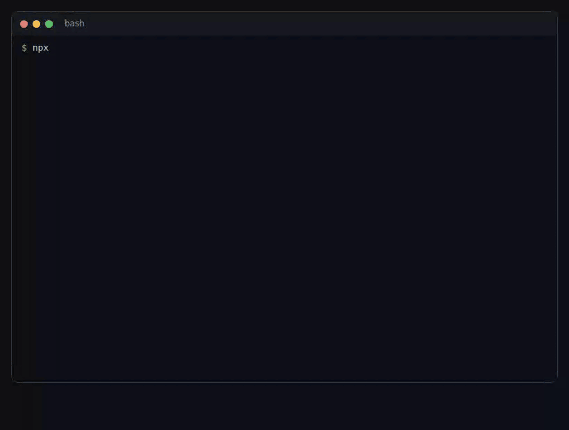
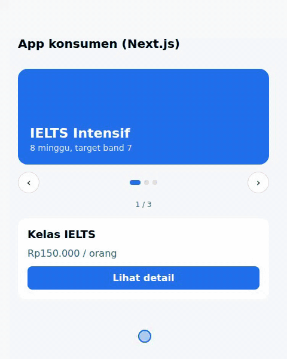
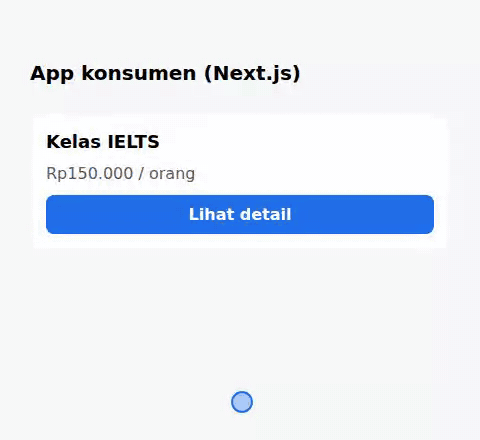
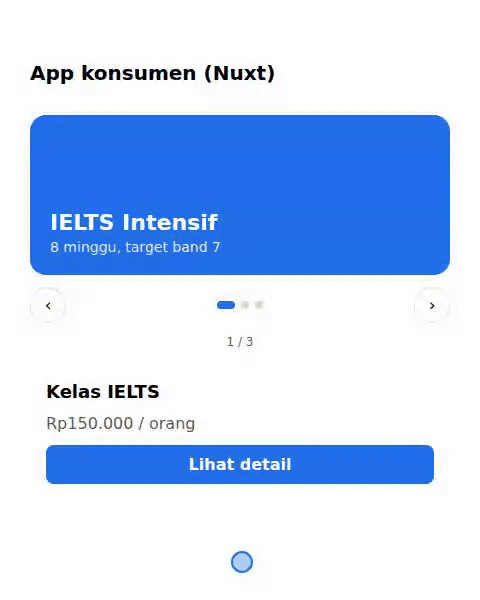

# xp: komponen JSX → web + iOS + Android, di-load lewat URL

Tulis komponen sekali dengan JSX + hooks, lalu satu perintah build menghasilkan bundle untuk web dan native. Tanpa React, tanpa React Native, dan **tanpa WebView**.

```bash
npm install
npm run build   # xp build examples --out dist
npm test        # 19 test: QuickJS (native), SSR, DOM, reconciler, slider
npm run serve   # xp serve dist --port 4400 (CORS + cache header)
npm run e2e     # app konsumen (Next.js/Nuxt) di Chromium, APP_URL=http://localhost:3300
npm run demo:gif  # rekam ulang GIF demo web, APP_URL=... OUT=docs/demo-next.gif
```



```
dist/
  manifest.json                      → nama → file terbaru, hash, primitive yang dipakai
  promo-modal.<hash>.d.ts            → tipe props (untuk autocomplete di app konsumen)
  promo-modal.web.<hash>.js          → browser + SSR     (~11 kB, runtime ikut)
  promo-modal.native.<hash>.js       → QuickJS (Android) / JavaScriptCore (iOS) (~7 kB, runtime ikut)
```

## Menulis komponen

```tsx
import { Modal, Pressable, Text, View, useState } from "@xp/runtime";

export default function PromoModal({ title }: { title: string }) {
  const [open, setOpen] = useState(false);
  return (
    <View>
      <Pressable onPress={() => setOpen(true)}><Text>{title}</Text></Pressable>
      <Modal visible={open} onRequestClose={() => setOpen(false)}>…</Modal>
    </View>
  );
}
```

- Tidak perlu `import React`: JSX runtime-nya milik xp.
- Hooks tersedia: `useState`, `useEffect`, `useMemo`, `useCallback`, `useRef`.
- Hanya boleh memakai primitive: `View`, `Text`, `Image`, `Pressable`, `ScrollView`, `TextInput`, `Modal`. Tag HTML ditolak oleh TypeScript.
- Di device tidak ada `document`, `window`, `fetch`, maupun `Intl`. Build memberi peringatan kalau bundle native memakainya.

### Animasi

Animasi ditulis secara deklaratif. JS hanya menentukan nilai akhir, lalu tiap platform menjalankan animasinya sendiri (CSS transition di web, `animate*AsState` di Android, `.animation` di iOS), jadi tetap mulus di device.

```tsx
// 1. Transisi perubahan style: backgroundColor, opacity, width, height, borderColor, color
<View style={{ backgroundColor: active ? "#1F6FEB" : "#D0D7DE", width: active ? 18 : 8,
               transitionDuration: 250, transitionTimingFunction: "ease-in-out" }} />

// 2. Animasi masuk: elemen yang muncul setelah mount bergerak dari nilai ini ke posisi normal.
//    Pakai bersama `key` yang berganti untuk konten yang diganti (mis. slide baru).
<View key={slideIndex} entering={{ opacity: 0, translateX: 28, duration: 320 }}>…</View>
```

`entering` tidak dijalankan saat render pertama, supaya konten hasil SSR tidak berkedip saat hydrate. Animasi yang mengikuti jari (gesture) belum didukung.

## Contoh komponen

Ada di folder [`examples/`](examples). Keduanya hanya memakai primitive dan `style`, jadi jalan sama di web, Android, dan iOS.

| Komponen | Isi |
|---|---|
| [`promo-modal`](examples/promo-modal.tsx) | Kartu promo + modal pendaftaran: state, kondisional, tombol nonaktif, hitung total |
| [`promo-slider`](examples/promo-slider.tsx) | Slider promo: tombol ‹ ›, titik indikator yang bisa diklik, berputar di ujung, slide bisa diganti lewat props. Beranimasi: warna latar dan titik aktif bertransisi, konten slide baru masuk dari arah navigasi |



```tsx
import { Pressable, Text, View, useState } from "@xp/runtime";

export default function PromoSlider({ slides = DEFAULT_SLIDES }: Props) {
  const [index, setIndex] = useState(0);
  const [direction, setDirection] = useState(1); // 1 = maju, -1 = mundur
  const active = Math.min(index, slides.length - 1);
  const current = slides[active];
  return (
    <View style={{ gap: 12 }}>
      <View style={{ height: 160, padding: 20, borderRadius: 16, justifyContent: "flex-end",
                     backgroundColor: current.color, transitionDuration: 350 }}>
        <View key={active} entering={{ opacity: 0, translateX: 28 * direction, duration: 320 }}>
          <Text style={{ color: "#FFFFFF", fontSize: 22, fontWeight: "700" }}>{current.title}</Text>
        </View>
      </View>
      {/* tombol ‹ ›, titik indikator, penghitung: lihat examples/promo-slider.tsx */}
    </View>
  );
}
```

Dipakai seperti komponen lain, dengan slide bawaan atau slide dari app:
```tsx
<PromoSlider />
<PromoSlider slides={[{ title: "Promo Oktober", subtitle: "Diskon 20%", color: "#CF222E" }]} />
```

Slider ini berpindah lewat tombol dan titik. Geser dengan jari (swipe) belum didukung, karena butuh mode paging di `ScrollView` yang belum ada di runtime.

## Konsumen web: Next.js (`@xp/next`)



```bash
npm i @xp/next
```
```js
// next.config.mjs
import { withXP } from "@xp/next";
export default withXP({}, { remotes: { ui: "https://cdn.kamu/xp" }, revalidate: 30 });
```
```tsx
// app/page.tsx: import seperti modul biasa
import PromoModal from "xp:ui/promo-modal";

export default function Page() {
  return <PromoModal title="Kelas IELTS" price={150000} />;
}
```

- **SSR:** HTML dirender di server, lalu bundle yang sama di-hydrate di browser (state dan event jalan).
- **Bertipe:** `withXP` mengunduh `.d.ts` ke `xp-env.d.ts`, jadi props yang salah langsung jadi error TypeScript.
- **Tanpa rebuild:** manifest dicek ulang tiap `revalidate` detik, sehingga deploy remote langsung terpakai.
- **Aman:** bundle diverifikasi dengan `sha256` dari manifest sebelum dijalankan.
- Pakai di **Server Component**. Props harus serializable (tidak bisa mengoper function).
- Remote mati saat build: dipakai manifest terakhir dari `.xp/`.
- Host remote cukup static hosting/CDN dengan CORS: `manifest.json` di-cache singkat, file ber-hash `immutable` (lihat `cli/serve.mjs`).

Contoh lengkap ada di `examples-consumer/next-app`. Untuk menjalankannya secara lokal:
```bash
npm run build && npm run serve                        # terminal 1: remote di :4400
cd adapters/next && npm pack                          # paket adapter (.tgz)
cd ../../examples-consumer/next-app && npm install
npx next build && npx next start -p 3300              # terminal 2
APP_URL=http://localhost:3300 npm run e2e             # terminal 3, dari root repo
```

## Konsumen web: Nuxt (`@xp/nuxt`)



```bash
npm i @xp/vite @xp/nuxt
```
```ts
// nuxt.config.ts
export default defineNuxtConfig({
  modules: ["@xp/nuxt"],
  xp: { remotes: { ui: "https://cdn.kamu/xp" }, revalidate: 30 },
});
```
```vue
<script setup lang="ts">
import PromoModal from "xp:ui/promo-modal";
</script>

<template>
  <PromoModal title="Kelas IELTS" :price="150000" />
</template>
```

Fiturnya sama dengan Next.js: SSR (lewat `useAsyncData`, sehingga HTML ikut payload dan client tidak merender ulang), hydrate, tipe props otomatis (`nuxi typecheck`), dan update tanpa rebuild. Contohnya ada di `examples-consumer/nuxt-app`:
```bash
cd examples-consumer/nuxt-app && npm install && npx nuxt build
PORT=3400 node .output/server/index.mjs
APP_URL=http://localhost:3400 npm run e2e    # dari root repo
```

Adapter framework lain yang berbasis Vite (SvelteKit, Astro, ...) cukup memakai `@xp/vite`: `xp({ remotes, framework })`, dengan `framework.code()` membuat wrapper komponen dan `framework.dts()` membuat deklarasi tipe. Runtime-nya (`@xp/vite/runtime`: `renderRemote`, `loadClient`) tidak bergantung pada framework.

## Konsumen mobile: Android (`adapters/android`)

Komponen yang sama dirender dengan Jetpack Compose. Tidak ada WebView: bundle native dijalankan di QuickJS, dan setiap primitive dipetakan ke komponen Compose (`Modal` → `Dialog`, `Pressable` → `clickable`, `TextInput` → `BasicTextField`).

```kotlin
// settings.gradle.kts
include(":xp-android")

// app/build.gradle.kts
dependencies {
    implementation(project(":xp-android"))
}
```
```xml
<!-- AndroidManifest.xml -->
<uses-permission android:name="android.permission.INTERNET" />
```
```kotlin
import dev.xp.android.XPView

@Composable
fun PromoScreen() {
    XPView(
        base = "https://cdn.kamu/xp",
        name = "promo-modal",
        props = mapOf("title" to "Kelas IELTS", "price" to 150000, "seats" to 3),
    )
}
```

Parameter opsional `XPView`:
- `modifier`: `Modifier` biasa.
- `loading`: tampilan saat bundle diunduh. Default-nya `CircularProgressIndicator`.
- `error`: tampilan kalau gagal, misalnya remote mati, versi protokol berbeda, atau primitive belum didukung.

Props harus bisa di-JSON-kan (`String`, angka, `Boolean`, `null`, `List`, `Map`). Kalau props berubah, komponen di-update tanpa remount, sehingga state di dalamnya tetap.

Saat development dengan emulator, remote lokal diakses lewat `http://10.0.2.2:4400`. Demo app lengkap dan langkah menjalankannya ada di [`adapters/android/README.md`](adapters/android/README.md).

GIF demo Android belum ada. Rekam dari emulator dengan `adb shell screenrecord /sdcard/demo.mp4` (atau tombol *Record* di panel emulator), lalu ubah jadi GIF dengan `ffmpeg` dan simpan sebagai `docs/demo-android.gif`.

## Konsumen mobile: iOS (`adapters/ios`)

Komponen yang sama dirender dengan SwiftUI. Logikanya dijalankan di JavaScriptCore bawaan iOS, tanpa WebView dan tanpa dependency pihak ketiga. `Modal` tampil sebagai `.sheet`, `Pressable` sebagai `Button`, dan `TextInput` sebagai `TextField`.

Pasang lewat Xcode: *File → Add Package Dependencies… → Add Local…* → `adapters/ios`, lalu tambahkan library **XPKit** (iOS 16+).

```swift
import SwiftUI
import XPKit

struct PromoScreen: View {
    var body: some View {
        XPView(
            base: URL(string: "https://cdn.kamu/xp")!,
            name: "promo-modal",
            props: ["title": "Kelas IELTS", "price": 150000, "seats": 3]
        )
    }
}
```

Props harus bisa di-JSON-kan (`String`, angka, `Bool`, `Array`, `Dictionary`). Kalau props berubah, komponen di-update tanpa remount, sehingga state di dalamnya tetap. Untuk development dengan `http://`, tambahkan `NSAllowsLocalNetworking` di Info.plist. Simulator bisa langsung mengakses `http://localhost:4400` di Mac.

Demo, tes (`swift test`), dan detail lainnya ada di [`adapters/ios/README.md`](adapters/ios/README.md).

GIF demo iOS belum ada. Rekam dari Simulator dengan `xcrun simctl io booted recordVideo demo.mp4`, lalu ubah jadi GIF dengan `ffmpeg` dan simpan sebagai `docs/demo-ios.gif`.

## Cara kerja

```
komponen.tsx ──xp build──┬─ web.js    → DOM host (client) / HTML host (SSR)
                         └─ native.js → QuickJS di SDK → operasi UI → SwiftUI / Compose
```

Runtime (reconciler + hooks) sama untuk semua target. Ia tidak menggambar apa pun; ia hanya menghasilkan **operasi UI**. Yang menggambar adalah host di masing-masing platform.

## Protokol untuk SDK iOS/Android

Ini satu-satunya kontrak yang perlu diimplementasikan tim mobile (`runtime/protocol.ts`, acuannya `sdk-reference/tree.ts`).

**SDK → JS** (mode antrean, paling sederhana: SDK cukup bisa `evaluate(script)`)
1. Buat context QuickJS. Opsional: pasang `globalThis.__xp_native = { send(batchJson) }` untuk mode bridge.
2. Unduh `manifest.json` → `components[nama].native.file`, lalu verifikasi `sha256`-nya.
3. `eval(bundle)` (QuickJS di Android, JavaScriptCore di iOS), lalu panggil `XP.mount(propsJson)`.
4. Saat ada event: `XP.dispatch(handlerKey, argsJson)`.
5. Setiap `XP.*` mengembalikan string JSON berisi daftar batch, sinkron. Tidak perlu menjalankan microtask. (Mode bridge: batch dikirim lewat `send`, dan hasilnya `"[]"`.)

**JS → SDK**, lewat `send`:
```json
{ "v": 1, "ops": [
  ["create", 5, "Pressable"],
  ["props", 5, { "style": {…}, "onPress": { "$fn": "5:onPress" } }],
  ["children", 0, [1]],
  ["delete", 7]
]}
```

| Op | Arti |
|---|---|
| `create id type` | buat node primitive |
| `props id {…}` | prop yang berubah saja; `null` = hapus; `{"$fn": key}` = handler event |
| `children id [ids]` | urutan anak lengkap; node `0` = root |
| `delete id` | hapus node |

`#text` adalah teks mentah: gabungkan semua `#text` di dalam `Text` menjadi satu string. Layout dari `style` dihitung dengan Yoga (flexbox), lalu view SwiftUI/Compose ditempatkan sesuai hasilnya.

## Status

- **M1 (selesai, teruji):** runtime, protokol, host native/DOM/SSR, CLI build + manifest. Bundle native dijalankan di QuickJS, dan hasilnya (modal, state, total, kondisional, event, update props, unmount) diverifikasi lewat tree operasi.
- **Adapter Next.js & Nuxt (selesai, teruji di Chromium):** import `xp:ui/nama`, SSR + hydrate, tipe otomatis, update tanpa rebuild. Nuxt dibangun di atas `@xp/vite`, yang juga bisa dipakai untuk SvelteKit.
- **SDK Android (`adapters/android`):** `XPView(base, name, props)`, yang memakai QuickJS (zipline) + Jetpack Compose, plus demo app. Inti-nya (tree, style, JSON) teruji dengan kotlinc terhadap sesi rekaman QuickJS. Bagian Compose belum dikompilasi di sini; lihat `adapters/android/README.md`.
- **SDK iOS (`adapters/ios`):** `XPView(base:name:props:)`, yang memakai JavaScriptCore + SwiftUI, plus demo `ContentView`. Bundle native sudah terbukti jalan di JavaScriptCore (disimulasikan lewat Bun dengan alur yang sama seperti `XPEngine`). Kode Swift belum dikompilasi; jalankan `swift test` di Mac untuk memastikannya.
- **M2 sisa:** uji Android & iOS di emulator/simulator, Yoga untuk layout identik.
- **M3:** dev server + HMR ke device, API plugin, signing bundle, pengecekan kapabilitas host, hydration yang mengklaim node SSR (saat ini client merender ulang isi yang identik).
